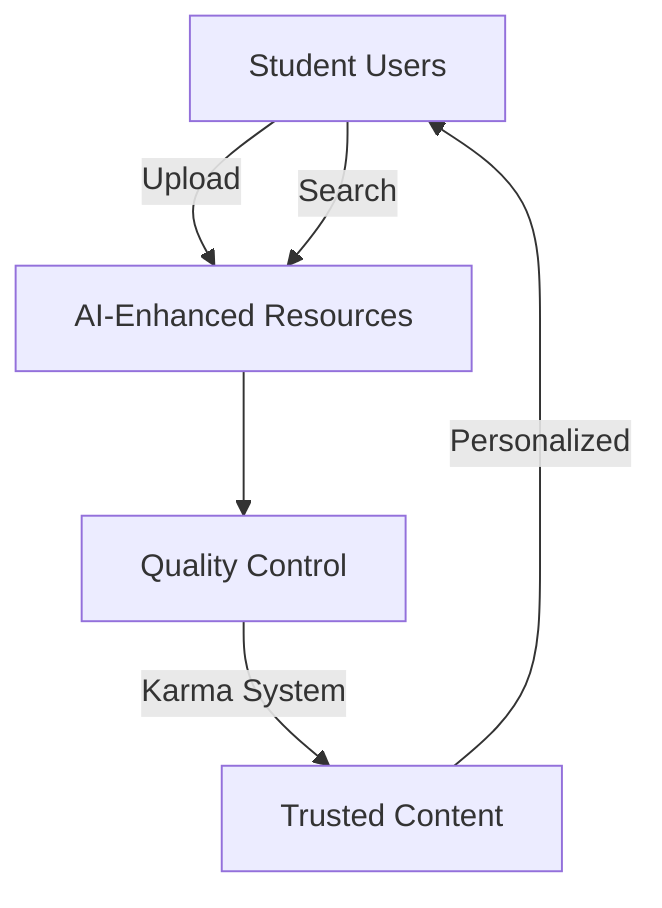

# EduShare Hub: Student-Powered Learning Platform


## Overview
EduShare Hub is a vibrant e-library platform where students share and discover high-quality learning resources. Combining AI-powered features with community-driven content, we're building the future of collaborative education for teens and university students.



## ✨ Key Features

- **AI-Powered Content Analysis**
  - Auto-tagging & metadata enrichment
  - Copyright detection
  - Content summarization
- **Student-Centric Design**
  - Age-specific themes (Teens/University)
  - Karma reputation system
  - Collections and favorites
- **Community Ecosystem**
  - Resource ratings and comments
  - Moderated content
  - Contribution leaderboards
- **Modern Tech Stack**
  - Next.js 15 with App Router
  - Chakra UI for accessible design
  - Supabase backend
  - Hugging Face AI integration

## 🛠 Tech Stack

**Frontend**  


**Backend**  


**AI Services**  


## 🚀 Getting Started

### Prerequisites
- Node.js 20+
- Supabase account
- Hugging Face API token

### Installation
1. Clone the repository:
```bash
git clone https://github.com/yourusername/edushare-hub.git
cd edushare-hub
```

2. Install dependencies:
```bash
npm install
```

3. Set up environment variables:
```bash
cp .env.example .env.local
```

4. Configure your environment variables:
```env
# Supabase
NEXT_PUBLIC_SUPABASE_URL=your-supabase-url
NEXT_PUBLIC_SUPABASE_ANON_KEY=your-anon-key

# Hugging Face
HF_API_TOKEN=your-hf-token

# App Configuration
NEXT_PUBLIC_BASE_URL=http://localhost:3000
```

5. Run the development server:
```bash
npm run dev
```

## 🧩 Project Structure

```
src/
├── app/          # App router with RSC
├── components/   # UI components
├── lib/          # Utilities and services
├── types/        # TypeScript definitions
├── styles/       # Global styles and theme
└── tests/        # Test suites
```

## 🔧 Configuration

### Theming System
Configure themes in `src/styles/theme.ts`:
```ts
const theme = extendTheme({
  colors: {
    modes: {
      teen: {
        primary: '#9B59B6',
        secondary: '#1ABC9C',
        // ...
      },
      university: {
        primary: '#3498DB',
        secondary: '#2ECC71',
        // ...
      }
    }
  }
});
```

### AI Services
Set up AI endpoints in `src/lib/ai/`:
```ts
// nlpProcessor.ts
export const generateTags = async (text: string) => {
  const response = await hf.textClassification({
    model: 'bhadresh-savani/bert-base-go-emotion',
    inputs: text,
  });
  // Process response
};
```

## 🌐 Deployment

Deploy to Vercel with zero configuration:

[](https://vercel.com/new/clone?repository-url=https%3A%2F%2Fgithub.com%2Fyourusername%2Fedushare-hub)

### Environment Variables on Vercel:
| Variable Name | Description |
|---------------|-------------|
| `SUPABASE_URL` | Your Supabase project URL |
| `SUPABASE_ANON_KEY` | Supabase anonymous key |
| `HF_API_TOKEN` | Hugging Face API token |
| `NEXTAUTH_SECRET` | Authentication secret |

## 🤝 Contributing

We welcome contributions! Please follow these steps:

1. Fork the project
2. Create your feature branch (`git checkout -b feature/amazing-feature`)
3. Commit your changes (`git commit -m 'Add some amazing feature'`)
4. Push to the branch (`git push origin feature/amazing-feature`)
5. Open a pull request

### Coding Standards
- Follow TypeScript strict mode
- Use Chakra UI components consistently
- Write unit tests for new features
- Document complex logic with JSDoc comments

## 📄 License

Distributed under the MIT License. See `LICENSE` for more information.

---

**EduShare Hub** © 2025 - Democratizing education through collaborative learning. Share knowledge, grow together.